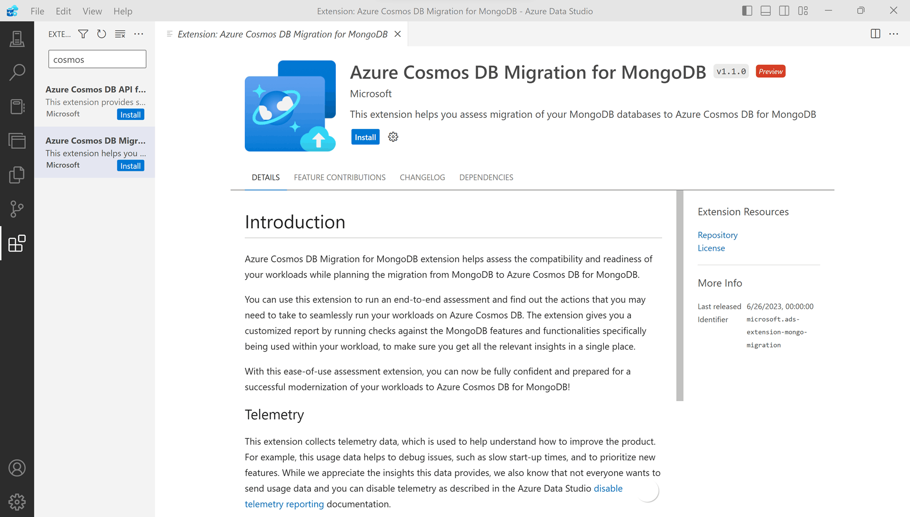
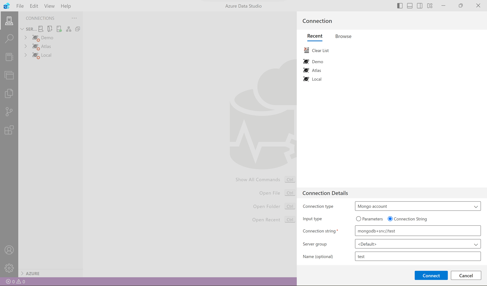
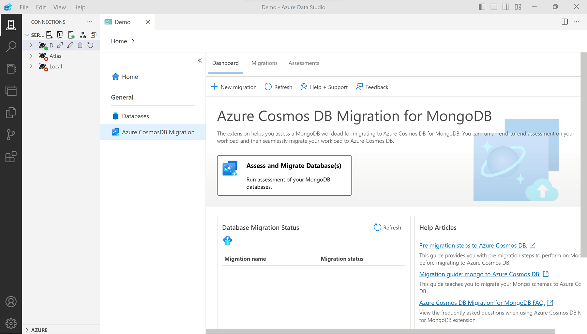
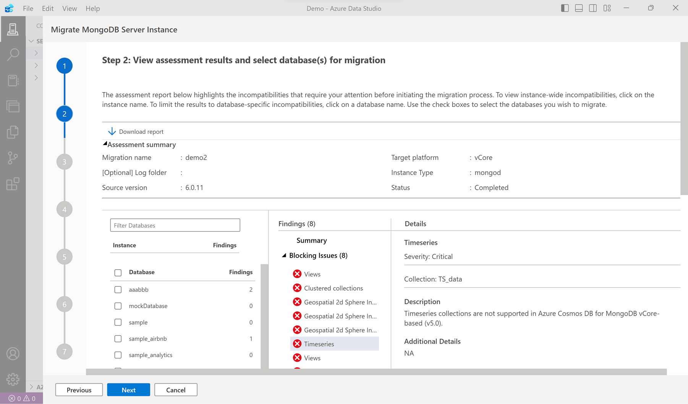
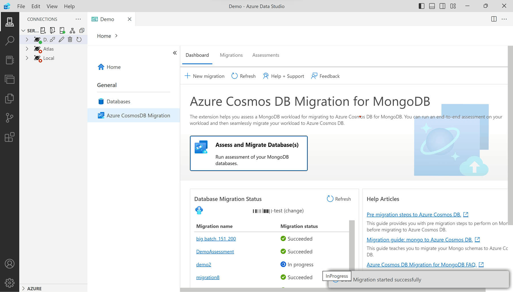
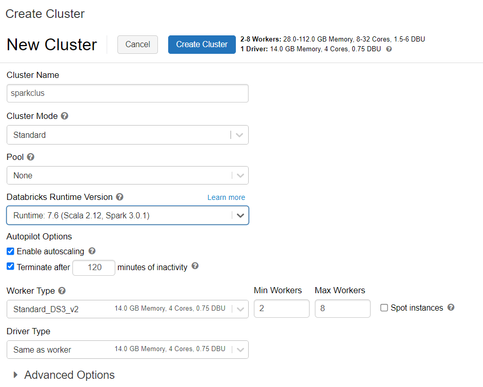
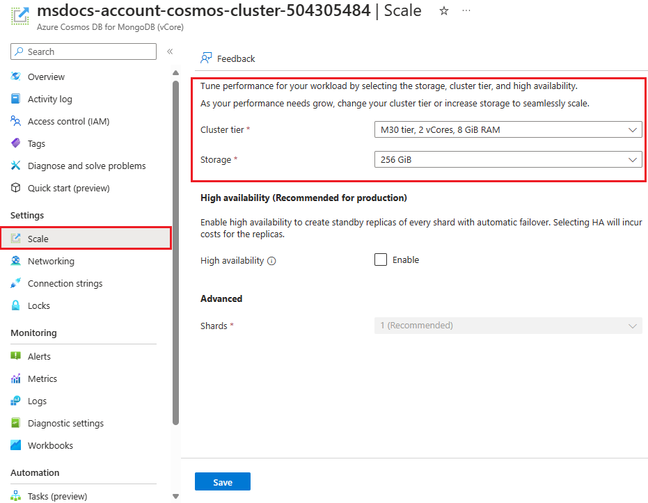
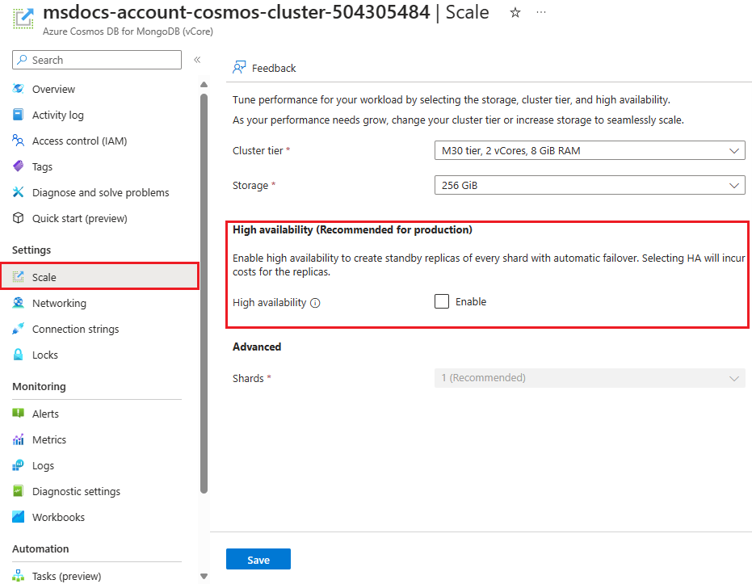
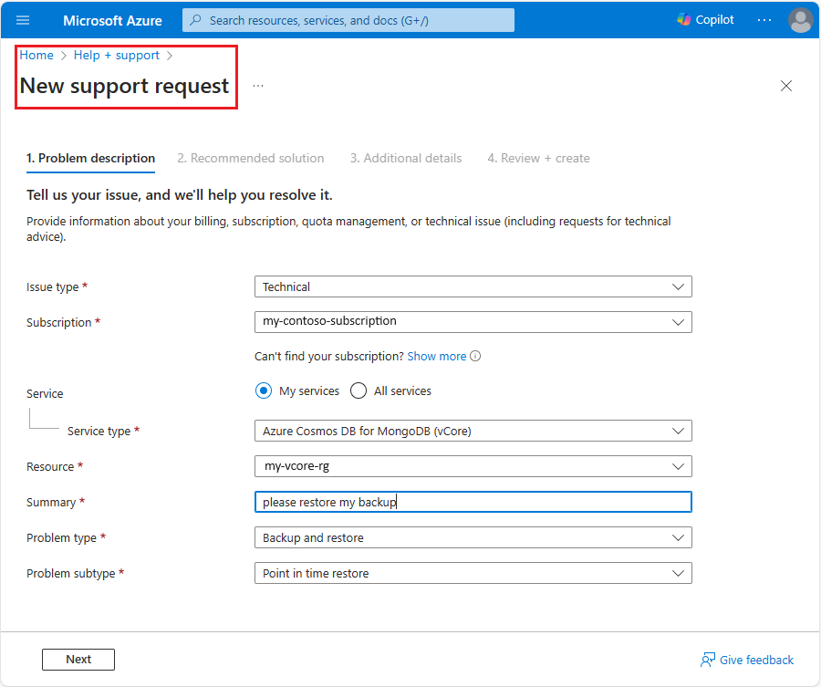
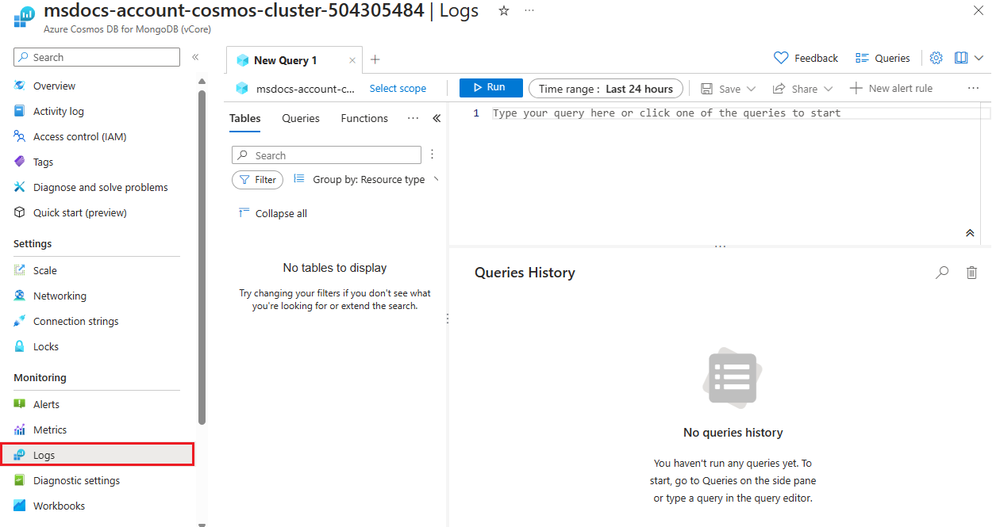

# Azure Cosmos DB Developer Cloud Skills Challenge Part 2

URL: <https://learn.microsoft.com/en-us/collections/zkgzhp65nxoy?WT.mc_id=cloudskillschallenge_60d54986-b94f-45e3-9653-2917c91648e7>

- [Azure Cosmos DB Developer Cloud Skills Challenge Part 2](#azure-cosmos-db-developer-cloud-skills-challenge-part-2)
  - [Implement vCore-based Azure Cosmos DB for MongoDB](#implement-vcore-based-azure-cosmos-db-for-mongodb)
    - [vCore-based Azure Cosmos DB for MongoDB](#vcore-based-azure-cosmos-db-for-mongodb)
    - [Create a vCore-based Azure Cosmos DB for MongoDB cluster](#create-a-vcore-based-azure-cosmos-db-for-mongodb-cluster)
    - [Exercise: Deploy a vCore-based Azure Cosmos DB for MongoDB cluster](#exercise-deploy-a-vcore-based-azure-cosmos-db-for-mongodb-cluster)
      - [Create vCore-based Azure Cosmos DB for MongoDB account](#create-vcore-based-azure-cosmos-db-for-mongodb-account)
      - [Connect to your vCore-based Azure Cosmos DB for MongoDB account using the Azure portal](#connect-to-your-vcore-based-azure-cosmos-db-for-mongodb-account-using-the-azure-portal)
      - [Connect to your vCore-based Azure Cosmos DB for MongoDB account using the Azure portal's Mongo Shell](#connect-to-your-vcore-based-azure-cosmos-db-for-mongodb-account-using-the-azure-portals-mongo-shell)
      - [Clean Up](#clean-up)
  - [Migrate to vCore-based Azure Cosmos DB for MongoDB](#migrate-to-vcore-based-azure-cosmos-db-for-mongodb)
    - [Migration assessment and planning](#migration-assessment-and-planning)
      - [Pre-migration discovery](#pre-migration-discovery)
      - [Assess the Pre-migration](#assess-the-pre-migration)
      - [Map the Pre-migration](#map-the-pre-migration)
      - [Pre-migration logistics plan](#pre-migration-logistics-plan)
    - [Post-migration](#post-migration)
  - [Offline migration from MongoDB to vCore-based Azure Cosmos DB for MongoDB using MongoDB native tools](#offline-migration-from-mongodb-to-vcore-based-azure-cosmos-db-for-mongodb-using-mongodb-native-tools)
    - [Get ready for the migration (MongoDB native tools)](#get-ready-for-the-migration-mongodb-native-tools)
    - [Choose your MongoDB native tool](#choose-your-mongodb-native-tool)
  - [Offline migration from MongoDB to vCore-based Azure Cosmos DB for MongoDB using Azure Data Studio](#offline-migration-from-mongodb-to-vcore-based-azure-cosmos-db-for-mongodb-using-azure-data-studio)
    - [Get ready for the migration (Azure Data Studio)](#get-ready-for-the-migration-azure-data-studio)
    - [Perform the migration (Azure Data Studio)](#perform-the-migration-azure-data-studio)
      - [Connect to MongoDB instance](#connect-to-mongodb-instance)
      - [Assess the MongoDB instance](#assess-the-mongodb-instance)
      - [Perform an offline migration of MongoDB databases](#perform-an-offline-migration-of-mongodb-databases)
  - [Migrate Data from MongoDB to vCore-based Azure Cosmos DB for MongoDB using Azure Databricks](#migrate-data-from-mongodb-to-vcore-based-azure-cosmos-db-for-mongodb-using-azure-databricks)
    - [Why Azure Databricks?](#why-azure-databricks)
    - [Pre-requisites](#pre-requisites)
    - [Perform the migration (Azure Databricks)](#perform-the-migration-azure-databricks)
    - [Execute the migration](#execute-the-migration)
    - [Enhance the migration performance](#enhance-the-migration-performance)
  - [Exercise: Migrate to vCore-based Azure Cosmos DB for MongoDB with MongoDB native tools](#exercise-migrate-to-vcore-based-azure-cosmos-db-for-mongodb-with-mongodb-native-tools)
    - [Objectives](#objectives)
    - [Exercise](#exercise)
      - [Setup](#setup)
      - [Install and load data into the MongoDB community edition on your local machine](#install-and-load-data-into-the-mongodb-community-edition-on-your-local-machine)
      - [Install the MongoDB Database Tools](#install-the-mongodb-database-tools)
      - [Load data into the MongoDB community edition](#load-data-into-the-mongodb-community-edition)
      - [Migrate to a vCore-based Azure Cosmos DB for MongoDB account using MongoDB native tools (offline)](#migrate-to-a-vcore-based-azure-cosmos-db-for-mongodb-account-using-mongodb-native-tools-offline)
      - [Clean up](#clean-up-1)
  - [Manage a vCore-based Azure Cosmos DB for MongoDB cluster](#manage-a-vcore-based-azure-cosmos-db-for-mongodb-cluster)
    - [Scale and configure a vCore-based Azure Cosmos DB for MongoDB cluster](#scale-and-configure-a-vcore-based-azure-cosmos-db-for-mongodb-cluster)
      - [Determine when to scale the cluster](#determine-when-to-scale-the-cluster)
      - [Understand cluster tiers](#understand-cluster-tiers)
      - [Configuring scale and capacity changes](#configuring-scale-and-capacity-changes)
    - [Explore high availability in a vCore-based Azure Cosmos DB for MongoDB cluster](#explore-high-availability-in-a-vcore-based-azure-cosmos-db-for-mongodb-cluster)
      - [Understand availability zone support](#understand-availability-zone-support)
      - [Implement high availability and disaster recovery](#implement-high-availability-and-disaster-recovery)
      - [Enable high availability](#enable-high-availability)
    - [Backup and restore a vCore-based Azure Cosmos DB for MongoDB cluster](#backup-and-restore-a-vcore-based-azure-cosmos-db-for-mongodb-cluster)
      - [Explore the backup process](#explore-the-backup-process)
      - [Explore the restore process](#explore-the-restore-process)
    - [Monitor a vCore-based Azure Cosmos DB for MongoDB cluster](#monitor-a-vcore-based-azure-cosmos-db-for-mongodb-cluster)
      - [Utilize Azure Monitor with Azure Log Analytics or Azure Storage](#utilize-azure-monitor-with-azure-log-analytics-or-azure-storage)
      - [Monitor cluster with Azure Monitor](#monitor-cluster-with-azure-monitor)
      - [Utilize diagnostic logs](#utilize-diagnostic-logs)
      - [Explore Kusto monitor queries](#explore-kusto-monitor-queries)
    - [Exercise: Manage a vCore-based Azure Cosmos DB form MongoDB cluster](#exercise-manage-a-vcore-based-azure-cosmos-db-form-mongodb-cluster)
      - [Objectives (Manage DB)](#objectives-manage-db)
      - [Requirements](#requirements)
      - [Notes](#notes)
      - [Scale vCore-based Azure Cosmos DB for MongoDB account](#scale-vcore-based-azure-cosmos-db-for-mongodb-account)
      - [Monitor a vCore-based Azure Cosmos DB for MongoDB account](#monitor-a-vcore-based-azure-cosmos-db-for-mongodb-account)
      - [Review Logs](#review-logs)
      - [Alert Rule](#alert-rule)

## Implement vCore-based Azure Cosmos DB for MongoDB

- Scalability and compatibility for MongoDB applications.

### vCore-based Azure Cosmos DB for MongoDB

- Fully managed, MongoDB-compatible database service.
- Seamless Azure integration.
- Low cost of ownership. Leveraging scalability and flexibility from Azure.

1. AI-driven applications simplified.
   - Vector search feature.
   - Simplifies data indexing and querying.
2. Seamless Azure integration
   - Integration with Azure ecosystem.
3. Cost-effective cluster management
   - Tiered offering. Choose right level of resources for the cluster without over-spending.
4. Flexible and efficient scaling
   - Easy scaling both horizontally and vertically, without downtime.
   - This flexibility ensures effective scaling without immediate need for shard key.

### Create a vCore-based Azure Cosmos DB for MongoDB cluster

- Applications needing high scalability, complex query processing and high availability.
- Ideal for both migration and new applications.
- Key advantages:
  - Migration and new projects.
  - Complex workloads.
  - High availability and scalability.
  - Vector search.
- Mongo DB compatibility.
  - <https://learn.microsoft.com/en-us/azure/cosmos-db/mongodb/vcore/compatibility>
  - Seamless integration.
- Creating a vCore-based Azure Cosmos DB for MongoDB cluster.
  - Can be created using Azure portal and Azure CLI.
  - For CLI, can be created with a bicep, Azure Resource Manager template or Terraform.

### Exercise: Deploy a vCore-based Azure Cosmos DB for MongoDB cluster

#### Create vCore-based Azure Cosmos DB for MongoDB account

1. Sign in to Azure portal.
2. Create a new resource.
3. Search for Azure Cosmos DB.
4. Click on Create.
5. In `Create Azure Cosmos DB Account`, select `Azure Cosmos DB for MongoDB` and click on `Create`.
6. In `Create Azure Cosmos DB Account - Choose Architecture`, select `vCore cluster (Recommended)` and click create.
7. In `Create Azure Cosmos DB for MongoDB cluster` window, fill in details.
   1. Basics tab
      - Subscription: Choose subscription.
      - Resource Group: Choose resource group.
      - Cluster Name: Enter a unique name.
      - Location: Choose location.
      - Cluster Tier: Choose tier. Select `Configure` and familiarize with the options in `Scale` window. Select
        `Free Tier` and `Save`.
      - MongoDB Version: 6.0
      - Admin Username: Enter username.
      - Password: Enter password.
      - Note: Only 1 free tier cluster per Azure account. `High Availability` on `Cluster Tier`, strongly consider
        to prevent downtime but incurs additional cost.
   2. Networking tab
      - Connectivity method: Public access (allowed IP addresses).
      - Firewall rules: `Allow public access from Azure services and resources within Azure to this cluster`. Allow
        to use Azure portal Mongo shell.
      - Firewall rules: Manually add IP ranges.
      - On Production:
        - Private Access and use virtual network and subnet.
        - Private endpoints.
        - Firewall rules:
          - `Add current IP address (your current public IP address)` and `Add 0.0.0.0 - 255.255.255.255`.
          - First option benign if client public IP never changes.
          - Second option allows access to add range of `ALL` IP addresses. Use with caution.
8. Click on `Review + Create` and `Create`.

#### Connect to your vCore-based Azure Cosmos DB for MongoDB account using the Azure portal

1. Sign in to Azure portal.
2. In search bar, type `Azure Cosmos DB`.
3. Select the Azure Cosmos DB account.
4. Options including: `Overview`, `Quit start`, `Networking` and `Connection String`.
5. Overview:
   - Provides details on the account.
   - Reset password.
6. Quick start
7. Networking
   - Add IP addresses to firewall rules.
   - Private endpoint connections.
   - Allow public access from Azure services and resources within Azure to this cluster.
8. Connection String
   - Connection string for applications.
   - Copy only to secure locations.

#### Connect to your vCore-based Azure Cosmos DB for MongoDB account using the Azure portal's Mongo Shell

1. In `Azure Cosmos DB for MongoDB (vCore)`, select `Quick start`. Note: Need public access from Azure services and
   resources within Azure to this cluster.
2. In `Quick start`, select `Launch quick start`. Creates sample database to test on.
   - Enter password for admin created when vCore based Azure Cosmos DB for MongoDB account was created. Select
     `Next`.
   - `Create mew database and collection` and `Next`. MongoDB commands will be executed in the shell.
   - `Load data` and `Next`. Data will be loaded into the collection. `insertMany` command will be executed in the
     shell.
   - Three queries can be ran to test the data. Select `Try query` for each query.
   - `Done` to exit the quick start.
3. In `Quick start`, select `Mongo Shell`.
   - Enter password for admin created when vCore based Azure Cosmos DB for MongoDB account was created.
   - Test connection:
     - Show databases.

     ```bash
     show dbs
     ```

     - switch to `quickstartDB` database.

     ```bash
     use quickstartDB
     ```

     - Show collections.

     ```bash
     show collections
     ```

     - Find all documents in `sampleCollection` collection.

     ```bash
     sampleCollection.find()
     ```

   - Exit Mongo Shell.

     ```bash
     bash exit
     ```

#### Clean Up

1. Delete resource group.
2. Manually delete individual resources.
3. Verify deletion.
4. Review billing.

## Migrate to vCore-based Azure Cosmos DB for MongoDB

- Migrate from existing MongoDB to Azure Cosmos DB for MongoDB.
- Utilizing Azure Data Studio.
- Azure databricks for data migration.

### Migration assessment and planning

- Pre-migration -> Migration -> Post-migration.
- Plan the pre-migration.
- Phases:
  - Pre-migration discovery - Discover the existing MongoDB resources and create data estate spreadsheet.
  - Pre-migration assessment - Assess the existing MongoDB resources for migration readiness.
  - Pre-migration mapping - Map existing MongoDB resources to new vCore-based Azure Cosmos DB for MongoDB cluster.
  - Pre-migration logistics planning - Plan the logistics for the migration end-to-end.

#### Pre-migration discovery

- Discover the existing MongoDB resources. Identify all MongoDB databases, collections and indexes.
- Create a data estate spreadsheet to help keep track of the MongoDB resources.
- Data estate spreadsheet includes:
  - Comprehensive list of existing resources (database or collection).
  - Help plan the migration end-to-end.
  - Should be used as tracking document throughout the migration process.

#### Assess the Pre-migration

- Assess or find the MongoDB features that are not supported in Azure Cosmos DB for MongoDB.
- Know vCore-based Azure Cosmos DB for MongoDB cluster tier offerings.
- <https://learn.microsoft.com/en-us/azure/cosmos-db/mongodb/vcore/compatibility>

#### Map the Pre-migration

- Capacity planning.
  - Capacity requirements for the new vCore-based Azure Cosmos DB for MongoDB cluster.
  - Includes number of vCores, memory, and storage capacity.
- Plan the vCore-based Azure Cosmos DB for MongoDB data estate.
  - Map the existing MongoDB resources to the new vCore-based Azure Cosmos DB for MongoDB cluster.
  - Deciding which resources to migrate to the new cluster.

#### Pre-migration logistics plan

- Who is doing the migration?
  - assign individuals to migrate the resources and monitor the migration process.
- What tools are you going to use to do the migration?
  - native mongoDB tools, Azure Data Studio, Azure Databricks.
- In what order should we migrate the resources?
  - Plan & Prioritize the order of migration.
  - Good practice to start with resources that might take longer to migrate help in uncovering issues early in the
    migration process.
- How will you monitor the migration process?
  - Work with team to define the monitoring process.

### Post-migration

- Cut over your application - Redirect to the new vCore-based Azure Cosmos DB for MongoDB cluster.
- Plan your post migration configurations - Scaling, high availability, backup and restore.

## Offline migration from MongoDB to vCore-based Azure Cosmos DB for MongoDB using MongoDB native tools

- Suitable where, migration time can be flexible, ensuring smooth transition.

### Get ready for the migration (MongoDB native tools)

- Source MongoDB compatible with vCore-based Azure Cosmos DB for MongoDB.
- MongoDB native tools match your MongoDB version. If there is a mismatch, upgrade native tools.
- User setup in MongoDB with read and write permissions.
- Adjust firewall to allow access for vCore-based Azure Cosmos DB for MongoDB. Ensure secure connection between MongoDB
  instance and vCore-based Azure Cosmos DB for MongoDB.

### Choose your MongoDB native tool

- `mongoexport/mpngoimport` and `mongodump/mongorestore`.
- `mongoexport/mpngoimport`
  - Pack data into JSON.
  - Make sure to add `--ssl` for security.
  - More suitable for smaller datasets. When selective export or import is needed.
  - Straight forward but takes longer for larger datasets.
- `mongodump/mongorestore`
  - Bulk packing.
  - Preferred for larger datasets.
  - Effectively handles bulk data.
- Note: Keep an eye on the terminal for live feedback.

## Offline migration from MongoDB to vCore-based Azure Cosmos DB for MongoDB using Azure Data Studio

- Migrate using Azure Data Studio migration extension.
- Pre-requisites:
  - Azure Subscription.
  - VCore based Azure Cosmos DB for MongoDB account.
  - Install latest version of Azure Data Studio on workstation.
  - MongoDB running on version 3.2 or later.

### Get ready for the migration (Azure Data Studio)

- Navigate Azure Data Studio's extensions and install `Azure Cosmos DB Migration for MongoDB`.
  

### Perform the migration (Azure Data Studio)

- Connect to MongoDB instance - via extension.
- Assess the MongoDB instance - identify potential compatibility issues.
- Perform an offline migration of MongoDB databases

#### Connect to MongoDB instance

- Azure data studio -> Connections -> Select MongoDB as connection type -> Enter connection details -> Connect.
  

#### Assess the MongoDB instance

- Connection pane -> Manage -> Azure CosmosDB Migration -> Assess and Migrate Database(s).
- Provide necessary details in wizard -> Start Assessment.
  
- Review assessment results. Depending on the size of source server, assessment may take time.
  

#### Perform an offline migration of MongoDB databases

- Connection pane -> Manage -> Azure CosmosDB Migration.
- Choose databases and collections to migrate.
- Ensure target vCore based Azure Cosmos DB for MongoDB details are correct.
- Monitor migration progress.
  
- Once migration is complete, the status will be updated.
- Verify data in Azure Cosmos DB Account.

## Migrate Data from MongoDB to vCore-based Azure Cosmos DB for MongoDB using Azure Databricks

- Simplifies moving big datasets. Transfer of complex data straightforward.
- Detailed control over migration pace and data transformations, effectively handling large datasets.

### Why Azure Databricks?

- Platform as a Service (PaaS) for Apache Spark.
- Efficient method for both offline and online data migration.
- Architecture is specifically designed for extensive datasets.

### Pre-requisites

- vCore based Azure Cosmos DB for MongoDB account is active and properly configured.
- Provision Azure Databricks cluster, selecting Databricks Runtime 7.6 or later optimal for Apache Spark 3.0
  compatibility.
  
- Add the Maven MongoDB connector for Spark library to cluster. This library enables connections to both native
  MongoDB and Azure Cosmos DB for MongoDB.

### Perform the migration (Azure Databricks)

- Create either python or Scala notebook. Example python notebook:
  
  ```python
  from pyspark.sql import SparkSession

  sourceConnectionString = "mongodb://<USERNAME>:<PASSWORD>@<HOST>:<PORT>/<AUTHDB>"
  sourceDb = "<DB NAME>"
  sourceCollection =  "<COLLECTIONNAME>"
  targetConnectionString = "mongodb://<ACCOUNTNAME>:<PASSWORD>@<ACCOUNTNAME>.mongo.cosmos.azure.com:10255/?ssl=true&replicaSet=globaldb&retrywrites=false&maxIdleTimeMS=120000&appName=@<ACCOUNTNAME>@"
  targetDb = "<DB NAME>"
  targetCollection =  "<COLLECTIONNAME>"

  my_spark = SparkSession \
      .builder \
      .appName("myApp") \
      .getOrCreate()

  df = my_spark.read.format("com.mongodb.spark.sql.DefaultSource").option("uri", sourceConnectionString).option(
       "database", sourceDb).option("collection", sourceCollection).load()

  df.write.format("mongo").mode("append").option("uri", targetConnectionString).option("maxBatchSize",2500).option(
  "database", targetDb).option("collection", targetCollection).save()
  ```

### Execute the migration

- Execute notebook, monitor the process for potential rate limiting errors and adjust parameters as needed.

### Enhance the migration performance

- Depending on the vCore based Azure Cosmos DB for MongoDB cluster tier, tweak settings to optimize performance.
  - **Spark Cluster Configuration**: Optimize number of workers and cores impact computation capabilities.
  - **Batch Size Adjustments**: Tune `maxBatchSize` parameter to help mitigate rate limiting errors. Controls the
    number of documents sent to Azure Cosmos DB for MongoDB in each batch.

## Exercise: Migrate to vCore-based Azure Cosmos DB for MongoDB with MongoDB native tools

> [!NOTE]
> The exercise is done read only since unavailability of Azure Subscription.

### Objectives

- Migrate data from MongoDB to vCore-based Azure Cosmos DB for MongoDB using MongoDB native tools via `mongodump` and
  `mongorestore`.

### Exercise

#### Setup

1. Clone the GitHub repository - <https://github.com/MicrosoftLearning/mslearn-cosmosdb-mongodb-vcore.git>.
2. `02-migrate` folder contains `create-azure-resources.ps1` script to generate .env file.
3. Run the script for setup.

   ```powershell
   az login
   .\create-azure-resources.ps1
   ```

4. Copy and save environment variables. Verify the resources created in Azure portal.
5. Review the .env file.
6. vCore-based Azure Cosmos DB for MongoDB account requires firewall rules to be set (public access).
   `create-azure-resources.ps1` script sets the firewall rules and can be checked in Azure portal. If IP address
   is not available, run the following command.

   ```powershell
   Invoke-RestMethod -Uri 'http://ipinfo.io/ip' -Method Get
   ```

#### Install and load data into the MongoDB community edition on your local machine

1. Download MongoDB community server edition. <https://www.mongodb.com/try/download/community>
2. Select package - | Version | 6.0.14 | | Platform | Your current OS/Platform | | Package | Your current install
   package type |
3. Download and follow installation instructions.
   - Choose all default options.
   - Service name should be `MongoDB`.
   - `Install MongoDB Compass`.

#### Install the MongoDB Database Tools

1. Download `MongoDB Command Line Database Tools Download`. <https://www.mongodb.com/try/download/database-tools>
2. Select package - | Version | 100.9.4 or the latest version | | Platform | Your current OS/Platform | | Package |
   Your current install package type |
3. Download and follow installation instructions. Choose all default options and install.

Verify Installation:

1. Close and open VS code to check environment variables.
2. Open `02-migrate` folder in `Terminal`.
3. If the server is up it will reply else follow [official documentation](https://www.mongodb.com/docs/v6.0/tutorial/)
   to start the server. Update path if required.

   ```bash
   & "C:\Program Files\MongoDB\Tools\100\bin\mongostat"
   ```

#### Load data into the MongoDB community edition

1. Open `Terminal` in `MongoDB Tools` folder.
2. Load sample data into MongoDB community edition.

   ```bash
   & mongoimport --host localhost --port 27017 --db cosmicworks --collection customers --jsonArray --file ../data/cosmicworks/customers.json
   & mongoimport --host localhost --port 27017 --db cosmicworks --collection products --jsonArray --file ../data/cosmicworks/products.json
   & mongoimport --host localhost --port 27017 --db cosmicworks --collection salesOrders --jsonArray --file ../data/cosmicworks/salesOrders.json
   ```

#### Migrate to a vCore-based Azure Cosmos DB for MongoDB account using MongoDB native tools (offline)

`mongodump` and `mongorestore` tools are used to migrate data. In production with large datasets, might need to look
for alternate `Azure Data Migration Service`.

1. Dump data from local MongoDB into a BSON dump file.

   ```bash
   & mongodump --host localhost --port 27017 --db cosmicworks --out ../data/cosmicworks
   ```

   outputs the data to `../data/cosmicworks` folder.

2. Restore data from BSON dump file to vCore-based Azure Cosmos DB for MongoDB account.

   ```bash
   & mongorestore --uri "mongodb+srv://<user>:<password>@yourMongoDBClusterName.mongocluster.cosmos.azure.com/?tls=true&
   authMechanism=SCRAM-SHA-256&retrywrites=false&maxIdleTimeMS=120000" --db cosmicworks1 ../data/cosmicworks/cosmicworks
   ```

   replace yourMongoDBClusterName, and yourDatabaseName with your actual username, password, Azure MongoDB cluster name,
   and database name.

3. Verify data in the vCore-based Azure Cosmos DB for MongoDB account.

   - Open MongoDB Compass application.
   - Connect to the vCore-based Azure Cosmos DB for MongoDB account.
   - Continue on warning screen.
   - Database, collections and documents should be visible in lef-hand navigation pane.
   - Close MongoDB Compass.

> [!NOTE]
> `mongoexport` and `mongoimport` can also be used.

#### Clean up

Clean up resources in Azure portal.

## Manage a vCore-based Azure Cosmos DB for MongoDB cluster

- Scaling, high availability, backup, restore and diagnostics.

### Scale and configure a vCore-based Azure Cosmos DB for MongoDB cluster

- Proper scaling allows to adapt both increasing and decreasing demands.

#### Determine when to scale the cluster

- Analyze performance requirements.
- Evaluate Capacity needs.

#### Understand cluster tiers

- Resource allocated such as CPU(vCores) and memory(RAM), tailored for different needs.
  - Lower tiers like M30, M40 can be suitable for development.
  - Higher tiers like M50, M60, M80 can be suitable for production.

#### Configuring scale and capacity changes

- Modifications to cluster like tier or capacity can happen without downtime.
- To make adjustments -> vCore-based Azure Cosmos DB for MongoDB cluster's scale settings -> `Scale` tab ->
  Select desired tier and capacity -> `Save`.
  

### Explore high availability in a vCore-based Azure Cosmos DB for MongoDB cluster

- Ensures smooth operation even in case of failures, like earthquakes, power outages, etc.

#### Understand availability zone support

- Azure availability zones are atleast 3 unique physical locations within an Azure region.
  - Zone-redundant: Data is replicated across availability zones to enhance fault tolerance.
  - Zonal: Data is replicated within a single availability zone to enhance better data locality and performance.

#### Implement high availability and disaster recovery

- High availability enable replicate data shards across availability zones. When primary shard fail, system redirects
  to standby shard in different availability zone.
- Disaster recovery across various reasons from natural disasters to technical failures.
- Enabling high availability: Continuous availability and operational continuity.
- Backup and restore: Regular backups to ensure data safety.

#### Enable high availability

- High availability can be enabled in `Scale` tab of vCore-based Azure Cosmos DB for MongoDB cluster.
  

### Backup and restore a vCore-based Azure Cosmos DB for MongoDB cluster

- Offers point-in-time restore capabilities (PITR) to restore data to specific point in time.

#### Explore the backup process

- Automatic and continuous backup process.
- Advanced Encryption Standard (AES) 256-bit encryption for data security.
- Backup retained for 35 days for active clusters and 7 days for deleted clusters.

#### Explore the restore process

- Can be initiated via Azure Support Request (Help + Support).
  

### Monitor a vCore-based Azure Cosmos DB for MongoDB cluster

- Help maintain health and performance.
- Azure Monitor combined with either Azure Storage account or Azure log analytics workspace allows to capture and
  store diagnostic logs.

#### Utilize Azure Monitor with Azure Log Analytics or Azure Storage

- **Azure log analytics workspace**: real-time and complex analytics.
  - Detailed analysis and visualization of data.
  - Advanced querying capabilities.
- **Azure Storage account**: long-term data retention.
  - Securely store logs for extended periods, supporting compliance and historical analysis.
  - Accessing historical data to analyze performance trends and conduct audits.

#### Monitor cluster with Azure Monitor

- Azure monitor's diagnostics logs details operations with DB.
  - Tracking requests and analyzing performance metrics.
  - Identifying and resolving operational or performance anomalies.

#### Utilize diagnostic logs

- With either log analytics workspace or storage account, enable configuring diagnostic settings.
  - Continuous monitor and maintain the performance and health.
  - Proactively respond to changes in DB behavior.

#### Explore Kusto monitor queries

- Kusto Query Language (KQL) with log analytics workspace. Can be run in cluster's monitoring ***Logs*** page.
  

### Exercise: Manage a vCore-based Azure Cosmos DB form MongoDB cluster

> [!NOTE]
> The exercise is done read only since unavailability of Azure Subscription.

#### Objectives (Manage DB)

- Scale Azure Cosmos DB for MongoDB account to meet performance needs by adjusting cluster tier, storage capacity and
  and enabling high availability.
- Monitor using diagnostic settings to collect and analyze logs and metrics.
- General alerts to notify when certain conditions are met.

#### Requirements

- vCore-based Azure Cosmos DB for MongoDB account.
- Azure Storage account.
- Azure Log Analytics workspace.

#### Notes

- Code resources available in repo: <https://github.com/MicrosoftLearning/mslearn-cosmosdb-mongodb-vcore.git>.
- `03-manage` folder contains `create-azure-resources.ps1` script to generate .env file.

#### Scale vCore-based Azure Cosmos DB for MongoDB account

- vCore-based Azure Cosmos DB for MongoDB account -> Settings -> `Scale` tab.
- Adjust `Cluster tier`, `Storage capacity` and `High availability` settings and review the cost implications.

#### Monitor a vCore-based Azure Cosmos DB for MongoDB account

- Log analytics workspace and storage account can be used to monitor.
- Enabling diagnostic settings to collect logs and metrics.
- vCore-based Azure Cosmos DB for MongoDB account -> Monitoring Section -> Diagnostic settings -> Add diagnostic
  setting.

#### Review Logs

- Review logs after running simulation.
- vCore-based Azure Cosmos DB for MongoDB account -> Monitoring Section -> Logs

#### Alert Rule

- Create alert rule to notify when certain conditions are met.
- vCore-based Azure Cosmos DB for MongoDB account -> Monitoring Section -> Alerts -> Create alert rule.
